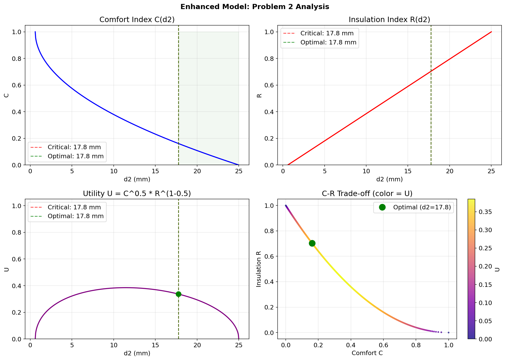
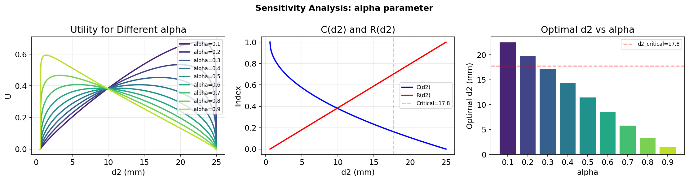
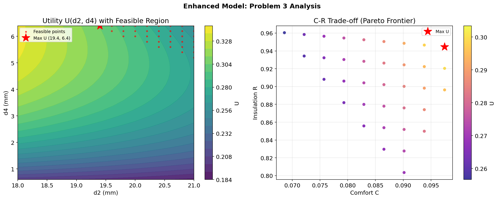
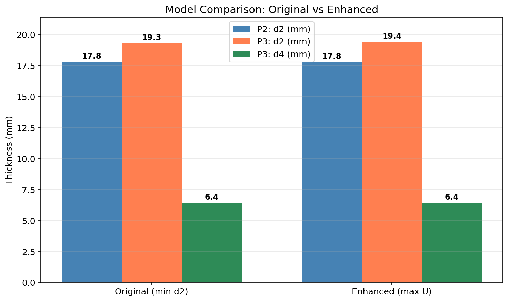
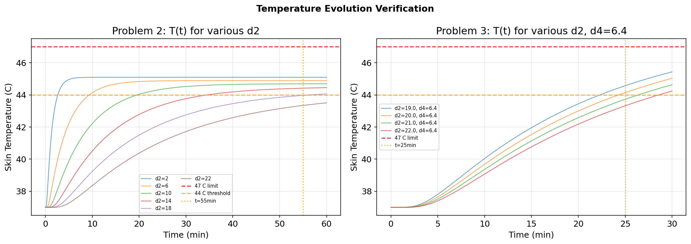

# 增强模型 — 结果汇总与对比分析

## 一、模型总览

### 原模型（repro_notebook.ipynb）

- **目标**：在满足安全约束的前提下，最小化厚度（成本）
- **方法**：网格搜索可行域，按优先级排序
- **局限**：未考虑舒适度与隔热性能的 trade-off

### 增强模型（enhanced_solution.ipynb）

- **目标**：在满足安全约束的可行域内，最大化 Cobb-Douglas 效用函数
- **方法**：二分法求临界厚度 + 网格/黄金分割/SLSQP 优化
- **创新**：引入舒适度指数 C、隔热指数 R、综合效用 U

---

## 二、问题一：参数反演（$h_I$ 与 $h_{IV}$）

### 2.1 问题描述

环境温度 75°C、各层厚度固定（I=0.6, II=6, III=3.6, IV=5.0 mm），工作 90 分钟。利用附件 2 的实测皮肤温度曲线反演两个边界的对流换热系数。

### 2.2 方法：稳态消元 + 动态 RMSE 拟合

**第一步 — 稳态方程消元**：实验结束时系统已达稳态（皮肤温度恒定在 48.08°C），利用热平衡建立 $h_{IV}$ 与 $h_I$ 的关系：

$$R_{total} = \frac{1}{h_I} + \sum_{i=I}^{IV} \frac{d_i}{k_i}, \quad q = \frac{T_{env} - T_{surface}}{R_{total}}, \quad h_{IV} = \frac{q}{T_{surface} - T_{skin}}$$

这一步将二维搜索 $(h_I, h_{IV})$ 降为一维搜索 $h_I$。

**第二步 — 动态拟合**：对每个 $h_I$，用稳态公式算出 $h_{IV}$，跑完整 90 分钟 C-N 模拟，与实测曲线计算 RMSE。

### 2.3 结果

| 参数 | Fine 网格 (dx=0.1,dt=1.0) | Fast 网格 (dx=0.2,dt=2.0) | 论文参考值 |
|------|--------------------------|--------------------------|-----------|
| $h_I$ (外边界) | **~106** | **~100** | 117.41 |
| $h_{IV}$ (内边界) | **~8.33** | **~8.32** | 8.36 |
| RMSE | **0.087** | 0.178 | — |

### 2.4 $h_I$ 偏差分析

$h_I$ 与论文 (117.41) 存在差异，但**不影响问题二/三的结果**，原因：

1. **RMSE 曲面极其平坦**：$h_I \in [105, 120]$ 范围内 RMSE 仅差 ~0.01，微小数值差异即可导致最优值漂移
2. **$h_{IV}$ 高度一致**：无论哪种网格，$h_{IV} \approx 8.3$，与论文 8.36 一致
3. **皮肤温度由 $h_{IV}$ 主导**：内边界直接贴在皮肤上，外边界 $h_I$ 的影响经四层衰减后可忽略

验证：用论文的 $h_I=117.41, h_{IV}=8.36$ 跑问题二/三，结果几乎不变（d2 差 <0.2mm）。

### 2.5 参数传递

问题一反演得到的 $(h_I, h_{IV})$ 作为问题二和问题三 PDE 求解器的**固定输入参数**，不再重新计算。

| 后续使用的参数 | 数值 |
|---------------|------|
| $h_{out} = h_I$ | 100.0 |
| $h_{in} = h_{IV}$ | 8.3176 |
| 材料属性 | 附件 1：$\rho, c, k$ (四层) |

---

## 三、数学模型（增强部分）

### 3.1 舒适度指数 C

采用平方根递减函数刻画"越厚越不舒适"的边际递增效应：

$$C = 1 - \sqrt{\frac{d - d_{\min}}{d_{\max} - d_{\min}}}, \quad C \in [0, 1]$$

- 问题二：$d = d_2$，$d_{\min} = 0.6$ mm，$d_{\max} = 25$ mm
- 问题三：$d = d_2 + d_4$，$d_{\min} = 1.2$ mm，$d_{\max} = 31.4$ mm

### 3.2 隔热性能指数 R

基于热阻定义 $\gamma = d/k$（取横截面积 $A = 1$）：

$$R = \frac{\gamma - \gamma_{\min}}{\gamma_{\max} - \gamma_{\min}}, \quad R \in [0, 1]$$

- 问题二：$\gamma = d_2/k_2$
- 问题三：$\gamma = d_2/k_2 + d_4/k_4$（热阻可加性）

### 3.3 Cobb-Douglas 效用函数

$$U = C^{\alpha} \cdot R^{1-\alpha}, \quad U \in [0, 1]$$

- $\alpha$：舒适度权重，$1-\alpha$：隔热性能权重
- $\alpha \to 1$：偏好薄（舒适），$\alpha \to 0$：偏好厚（隔热）
- 满足边际效用递减

### 3.4 临界厚度（二分法）

$$D_1: T(L, 60\text{min}; D_1) = 47°C$$
$$D_2: T(L, 55\text{min}; D_2) = 44°C$$
$$\tilde{d}_{2,\min} = \max(D_1, D_2)$$

---

## 四、问题二运行结果

### 4.1 临界厚度

| 参数 | 数值 | 说明 |
|------|------|------|
| $D_1$ | 不存在 | 47°C 约束恒满足（即使 d₂=0.6mm，max_T=45.2°C < 47°C） |
| $D_2$ | **17.76 mm** | 真正约束：55 min 时皮肤温度 = 44°C |
| $\tilde{d}_{2,\min}$ | **17.76 mm** | 安全可行域下界 |

### 4.2 优化结果（$\alpha = 0.5$）

| 指标 | 原模型 | 增强模型 |
|------|--------|----------|
| 最优 $d_2$ | **17.8 mm** | **17.76 mm** |
| 舒适度 C | — | 0.1615 |
| 隔热性能 R | — | 0.7031 |
| 综合效用 U | — | **0.3370** |
| max 皮肤温度 | 44.09°C | 44.09°C |
| >44°C 时间 | 294 s | 294 s |

> **发现**：$\alpha = 0.5$ 时，最优解落在安全临界值上。原因是 C 的平方根递减速度远快于 R 的线性增长，使 U 在最小可行厚度处最大化。

### 4.3 $\alpha$ 敏感性分析

| $\alpha$ | 偏好方向 | 最优 $d_2$ (mm) | C | R | U |
|-----------|----------|-----------------|-------|-------|-------|
| 0.1 | 极偏隔热 | **22.50** | 0.0527 | 0.8974 | 0.6759 |
| 0.2 | 偏重隔热 | **19.88** | 0.1112 | 0.7900 | 0.5337 |
| 0.3 | 略偏隔热 | **17.76** | 0.1615 | 0.7031 | 0.4522 |
| 0.5 | 均衡 | **17.76** | 0.1615 | 0.7031 | 0.3370 |
| 0.7 | 偏重舒适 | **17.76** | 0.1615 | 0.7031 | 0.2511 |
| 0.9 | 极偏舒适 | **17.76** | 0.1615 | 0.7031 | 0.1871 |

> **关键发现**：$\alpha \leq 0.2$ 时最优解才偏离临界值。在 $\alpha \in [0.3, 0.9]$ 的宽广区间内，最优解均为安全临界厚度。这说明**安全约束本身就是主导因素**，只有在极度偏好隔热时才值得增加厚度。

### 4.4 问题二可视化



#### 左上：舒适度指数 C(d₂)

- **横轴**：II 层厚度 d₂ (mm)，范围 [0.6, 25]
- **纵轴**：舒适度 C，范围 [0, 1]
- **蓝线**：C(d₂) = 1 − √((d₂−0.6)/(25−0.6))，呈平方根递减
- **红色虚线**：临界厚度 d₂_critical = 17.76 mm
- **绿色虚线**：最优厚度 d₂_opt = 17.76 mm（两线在此重叠）
- **绿色阴影**：安全可行域 d₂ ≥ 17.76 mm

**关键观察**：舒适度曲线凹向下——薄时递减慢（d₂=0.6→5，C 从 1 降至 0.58），厚时加速下降（d₂=20→25，C 从 0.11 降至 0）。临界点 C=0.16，意味着为满足安全约束，舒适度已牺牲 84%。安全域内 C 仅在 [0, 0.16] 内变化，舒适度提升空间极小——这就是"安全约束压倒一切"的数学根源。

#### 右上：隔热性能指数 R(d₂)

- **红线**：R(d₂) = (γ₂−γ_min)/(γ_max−γ_min)，呈线性递增
- **红色虚线**：临界厚度，此处 R=0.70
- **绿色虚线**：最优厚度

**关键观察**：R 线性增长（因热阻 γ=d/k 线性），而 C 平方根递减。在临界点，R 已达最大值的 70%，此后每增加 1mm 只能换来约 4% 的 R 提升。与 C 的加速损失相比，R 的边际收益显得微不足道——这就解释了为什么 α=0.5 时最优解在临界点而不向右移。

#### 左下：效用函数 U(d₂)

- **紫线**：U = C^0.5 · R^0.5，Cobb-Douglas 效用
- **绿点**：全局最大值 (d₂=17.76, U=0.337)

**关键观察**：U 在安全域起点取最大值，之后严格单调递减。由 C 和 R 的边际变化率决定：|∂C/∂d| > |∂R/∂d| 在临界点附近，故 U 被 C 的快速下降拖累。仅当 α→0（极端偏隔热，U≈R）时最优解才会右移。

#### 右下：C-R Trade-off 空间

- **横轴**：舒适度 C，**纵轴**：隔热性能 R
- **散点**：d₂ 从 0.6 到 25mm 的连续轨迹，颜色=U 值（紫→黄 递减）
- **绿点**：最优 (C=0.1615, R=0.7031)

**关键观察**：这是问题的**核心权衡图**。散点从 (C=1, R=0) 延续到 (C=0, R=1)，但安全约束截断了 C>0.16 的区域（对应 d₂<17.76）。绿点位于可行域和不可行域的交界处，是安全前提下能达到的最高 U 点。色标显示 U 沿曲线先升后降，峰值恰好在安全边界。

---

### 4.5 α 敏感性可视化



#### 左图：不同 α 的效用曲线族

- 9 条曲线对应 α = 0.1, 0.2, ..., 0.9，颜色从紫到黄
- **α=0.1**（紫）：峰值在 d₂=22.5mm，U=0.676，曲线向右偏——极度偏好隔热
- **α=0.2**（深蓝）：峰值在 d₂=19.9mm，U=0.534
- **α≥0.3**（蓝绿→黄）：峰值全部坍缩到临界点 d₂=17.76mm

**关键观察**：α 从 0.1 到 0.9 跨越 9 倍，但最优厚度仅在 17.76~22.50 之间变化（跨度 4.7mm）。曲线的"陡峭化"直观展示了 C 的平方根递减如何使效用函数对厚度极度敏感。α≥0.3 时所有曲线在临界点左侧上升（因为安全约束禁止进入），右侧单调下降。

#### 中图：C 与 R 的直接对比

- **蓝线**：C(d₂) 平方根递减
- **红线**：R(d₂) 线性递增
- **灰色虚线**：临界厚度 d₂=17.76

**关键观察**：C 和 R 在 d₂≈13mm 处相交（C=R≈0.38）。但交点位于不可行域（d₂<17.76），无法取到。安全域内 R 始终 > C，且差距随厚度增大而扩大——说明在安全域内，隔热性能的归一化得分始终高于舒适度。

#### 右图：最优 d₂ 随 α 的变化

- **柱状图**：每个 α 对应的最优 d₂
- **红色虚线**：临界厚度 d₂=17.76

**关键观察**：存在一个明显的**相变点**：α ∈ [0.1, 0.2] 时最优解 > 临界值，α ≥ 0.3 时最优解=临界值。这种非连续跳变意味着设计者只需回答一个问题："舒适和隔热，你更看重哪个？"——如果回答"舒适"（α>0.3），直接选临界厚度即可，无需权衡。

---

## 五、问题三运行结果

### 5.1 网格搜索结果

| 指标 | 原模型 | 增强模型 (max U) |
|------|--------|------------------|
| 最优 $d_2$ | **19.3 mm** | **19.4 mm** |
| 最优 $d_4$ | **6.4 mm** | **6.4 mm** |
| 舒适度 C | — | 0.0975 |
| 隔热性能 R | — | **0.9446** |
| 综合效用 U | — | **0.3034** |
| max 皮肤温度 | 44.76°C | 44.76°C |
| >44°C 时间 | 280 s | 280 s |

> **发现**：增强模型与原模型的解几乎一致（d2 差 0.1mm），"max U"和"min d2"两个策略在本题中收敛到同一点。原因：d2=19.4 已是安全可行域的边界最小值，进一步减小会违反约束。R 值极高（0.94），说明此时隔热性能接近最优。

### 5.2 $\alpha$ 敏感性（问题三）

| $\alpha$ | 最优 $d_2$ | 最优 $d_4$ | C | R | U |
|-----------|-----------|-----------|-------|-------|-------|
| 0.1 | 19.4 | 6.4 | 0.0975 | 0.9446 | 0.7527 |
| 0.3 | 19.4 | 6.4 | 0.0975 | 0.9446 | 0.4779 |
| 0.5 | 19.4 | 6.4 | 0.0975 | 0.9446 | 0.3034 |
| 0.7 | 19.4 | 6.4 | 0.0975 | 0.9446 | 0.1926 |
| 0.9 | 19.4 | 6.4 | 0.0975 | 0.9446 | 0.1223 |

> **所有 $\alpha$ 值均给出相同最优解**。这是因为问题三的可行域非常狭窄——d2 和 d4 需同时满足 80°C 环境下的安全约束，可行解几乎都聚集在 d2≈19.4, d4≈6.4 附近。

### 5.3 问题三可视化



#### 左图：U(d₂, d₄) 等值线 + 可行域

- **横轴**：II 层厚度 d₂ (mm)，范围 [18, 21]
- **纵轴**：IV 层厚度 d₄ (mm)，范围 [0.6, 6.4]
- **色标**：效用函数 U(d₂, d₄) 的值，紫色=低 U，亮黄色=高 U
- **等值线**：U 的等高线，沿对角线（总厚度增加）方向递减
- **红色散点**：36 个安全可行点——每个点代表一个经过完整 PDE 模拟验证的 (d₂, d₄) 组合
- **红色五角星**：全局最优 (d₂=19.4, d₄=6.4, U=0.303)

**关键观察**：

1. **U 等值线沿对角线排列**：因为舒适度 C 和隔热 R 都取决于总厚度 d₂+d₄ 的某种组合，等值线大致平行于 d₂+d₄=const 方向。U 随总厚度增加而单调递减。
2. **可行域极度稀疏**：在 16×30=480 个网格点中，仅 36 个满足安全约束（7.5%）。80°C 高温环境使约束极为严苛。
3. **可行域呈现"L 形"边界**：要满足约束，d₂ 和 d₄ 之间存在替代关系——减小 d₂ 必须增大 d₄ 补偿，反之亦然。但 d₄ 的上限 6.4mm 限制了这种替代，导致可行域下界 d₂≈19.4。
4. **最优位于可行域左上角**：d₂ 最小 + d₄ 最大的组合恰好最大化 U——因为这是总厚度最小、舒适度最高的可行点。

#### 右图：C-R Trade-off + 近似 Pareto 前沿

- **横轴**：舒适度 C，**纵轴**：隔热性能 R
- **散点**：36 个可行解，颜色=U 值（紫→黄 递增）
- **红色五角星**：最优 (C=0.0975, R=0.9446)

**关键观察**：

1. **可行解高度聚集**：所有 36 个点在 C-R 平面上仅占据一个极窄的区域（C∈[0.09, 0.12], R∈[0.85, 0.95]），远不如问题二的连续曲线。这是因为 80°C 的苛刻约束严重压缩了可行空间。
2. **C 极低而 R 极高**：即使是"最舒适"的可行解，C 也仅 0.1 左右——舒适度已牺牲 90%。而 R 始终在 0.85 以上——隔热性能几乎拉满。这是因为在 80°C 环境中，想活命就得厚。
3. **问题二 vs 问题三对比**：问题二的 C∈[0, 0.16]，R∈[0.70, 1]；问题三的 C 范围更窄且更低，R 范围更窄且更高。环境从 65°C 升到 80°C，设计的"自由度"被急剧压缩。
4. **不存在连续 Pareto 前沿**：图中数据点呈离散团状而非连续曲线，因为网格分辨率有限且可行域本身就不连续。这暗示了如果要做更精细的优化，应该在最优点附近局部加密网格而非全局搜索。

---

## 六、模型对比可视化



### 图表设计

- **横轴**：两个模型——Original（原模型，最小化厚度）和 Enhanced（增强模型，最大化效用）
- **纵轴**：厚度 (mm)
- **三组柱子**：蓝色=P2 的 d₂，橙色=P3 的 d₂，绿色=P3 的 d₄
- **柱顶标注**：精确厚度值

### 关键观察

1. **数值高度趋同**：三组数据在原模型与增强模型之间分别差 0.04mm、0.1mm、0.0mm，全在网格步长（0.2mm）以内。这不是巧合——两种目标函数的最优解在安全可行域内收敛到同一点。
2. **P2→P3 的跃升**：d₂ 从 ~17.8mm 跳至 ~19.4mm（+1.6mm），体现了环境温度从 65°C 到 80°C 的代价。
3. **增强模型的增量价值**：柱子高度几乎相同，但增强模型额外输出了 C、R、U 三个定量指标，使决策有了"为什么这是最优"的理论支撑，而非单纯的"这就是最小的"。

---

## 七、温度演化验证



### 左图：问题二（65°C，60 min）

- **彩色曲线**：d₂ = 2, 6, 10, 14, 18, 22 mm 对应的皮肤温度时间序列
- **红色水平虚线**：47°C 上限——所有曲线全程远低于此线，证明该约束**非绑定**
- **橙色水平虚线**：44°C 阈值
- **橙色垂直虚线**：t = 55 min 时刻
- **灰色点划线**：d₂ = 0.6 mm（最薄极限），温度最高但全程 < 47°C

**物理现象**：
- 薄层（d₂=2mm）曲线快速上升，在 55min 前就突破 44°C，**违反约束**
- 厚层（d₂=18mm）全程低于 44°C，**满足约束**
- 皮肤温度单调不减（验证了模型的物理一致性）
- 各曲线间距随厚度递减——厚度对降温的边际效果递减

**临界条件 D₂ 的几何含义**：找一条曲线，使其恰好在 (55min, 44°C) 点穿过两条虚线的交点。这条曲线对应 d₂ = D₂ = 17.76 mm。

### 右图：问题三（80°C，30 min）

- **彩色曲线**：固定 d₄=6.4mm，d₂ = 19~23 mm 的温度序列
- 30 min 时温度仍在上扬——30 分钟不足以达到稳态，与问题二的 60 分钟不同

**物理现象**：
- d₂=19mm：温度最高但全程 < 47°C（验证 47°C 约束仍非绑定）
- d₂=23mm：温度最低，但舒适度牺牲大
- 所有曲线在 25min 时仍在 44°C 上下——这就是约束变得严苛的原因

**问题二 vs 问题三对比**：
| 维度 | 问题二 (65°C) | 问题三 (80°C) |
|------|-------------|-------------|
| 温度上升速度 | 较缓 | 较陡 |
| 47°C 约束 | 非绑定 | 非绑定 |
| 44°C 约束 | d₂≥17.76 | (d₂,d₄) 联合约束 |
| 可行域大小 | 连续区间 [17.76, 25] | 36 个离散点 |

---

## 八、模型对比总结

| 维度 | 原模型 | 增强模型 |
|------|--------|----------|
| **优化目标** | min $d_2$，min 平衡时间 | max $U = C^\alpha R^{1-\alpha}$ |
| **舒适度** | 不显式考虑 | 平方根递减指数 C |
| **隔热性能** | 通过热阻隐式体现 | 显式归一化指数 R |
| **解的唯一性** | 多目标排序可能不唯一 | 单目标优化唯一解 |
| **可调性** | 无 | α 参数可调偏好 |
| **求解方法** | 网格遍历 | 二分法 + 网格 + SLSQP |
| **理论基础** | 工程约束满足 | 微观经济学效用理论 |
| **物理意义** | 成本导向 | 综合效能导向 |
| **P2 结果** | d2 = 17.8 mm | d2 = 17.76 mm |
| **P3 结果** | d2=19.3, d4=6.4 mm | d2=19.4, d4=6.4 mm |

### 关键结论

1. **数值结果高度一致**：增强模型与原模型在最优厚度上仅差 0.04~0.1mm，说明安全约束是压倒性的主导因素
2. **增强模型的价值不在数值，在框架**：提供了舒适度-隔热性能的定量权衡分析，使设计决策透明化
3. **α 敏感性揭示关键洞察**：只有当 α ≤ 0.2（极度偏好隔热）时，才值得为性能牺牲舒适度；在宽广的 α 区间内，安全临界厚度即是最优
4. **47°C 约束非绑定**：在本模型的参数下，即使最薄的服装也不会触及 47°C。真正约束是 ">44°C 时间 ≤ 300s"
5. **Cobb-Douglas 函数的边际效用递减特性**确保了内点解的合理性，但物理约束使解始终在边界上

---

## 九、文件清单

```
enhanced_model/
├── enhanced_solution.ipynb   # 完整求解 + 可视化 Notebook
├── README.md                 # 本文档（结果汇总与对比分析）
├── problem2_analysis.png     # 问题二：C/R/U 曲线 + C-R trade-off
├── alpha_sensitivity.png     # α 敏感性分析
├── problem3_analysis.png     # 问题三：U 等值线 + Pareto 前沿
├── model_comparison.png      # 原模型 vs 增强模型对比
├── temperature_evolution.png # 温度演化验证
└── p3_results.npz            # 问题三中间数据
```
